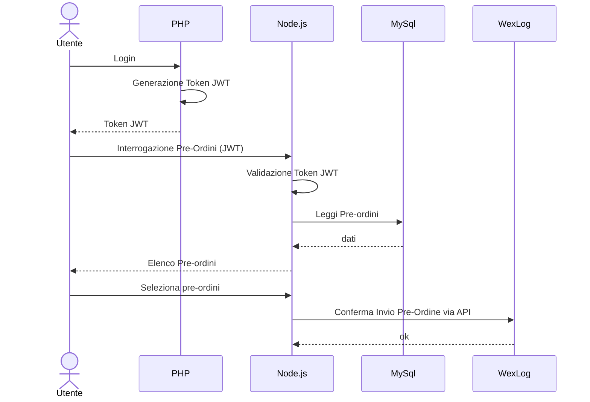
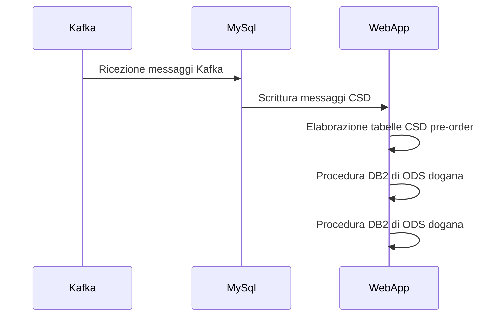
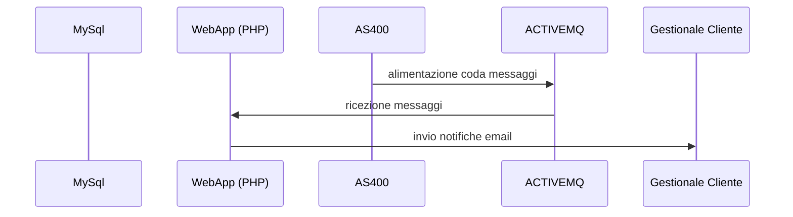
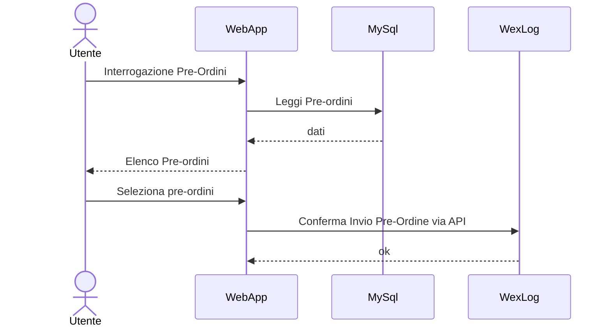
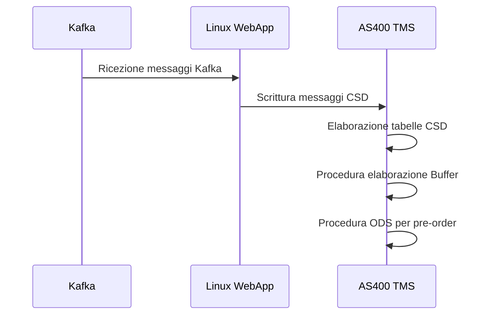
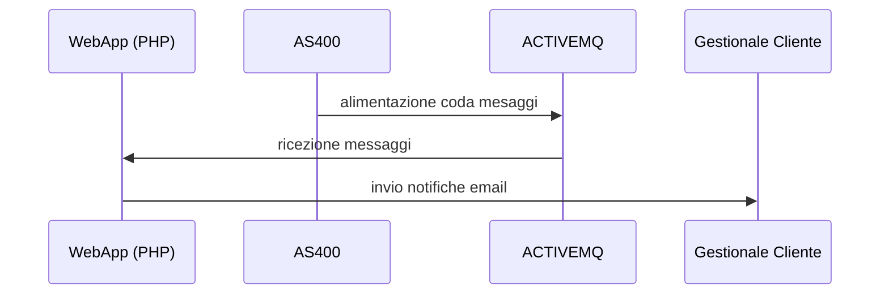

# Ipotesi A: refactoring completo

Revisione completa dei processi al di fuori della piattaforma IBM i

## Applicazione Lista Pre-ordini 

## Flow 1: Customer Data Reception and save in customer Specific Tables and ODS

## Flow 2

## Flow 3 

# Ipotesi B: Revisione parziale 

Revisione parziale dei processi cercando di conservare l’as-is al fine di contenere l’effort di sviluppo

## Flow 1: Customer Data Reception and save in customer Specific Tables and ODS

## Flow 2

Fill-in AS400 Data Queue in order to send back data to customer 

